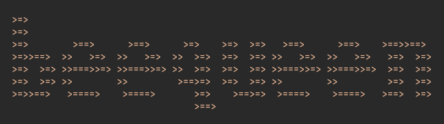

# QueenBee

<!---Esses são exemplos. Veja https://shields.io para outras pessoas ou para personalizar este conjunto de escudos. Você pode querer incluir dependências, status do projeto e informações de licença aqui--->
<!---Incrível trabalho do iuricode. Por favor, dá um confere: https://github.com/iuricode/readme-template --->

<!--



-->

> A tool to search, add and store [Beecrowd](https://www.beecrowd.com.br/judge/en) exercise resolutions. 

The project is still under development and the next updates will focus on the following tasks:

- [ ] Adding EXCEPTIONS on creation's tool (e.g. Invalid file)
- [ ] Adding OTHER FUNCTIONS (SEARCH, DELETE, GIT)
- [ ] Implement OTHER LANGUAGES (Java, Kotlin, C#, etc.)

## 💻 Prerequisites

Before you start, make sure you've met the following requirements:
* Python 3.7 or higher

## 🚀 Instaling QueenBee

Linux e macOS:
```
git clone <link>
cd QueenBee
python3 installer.py
```

Windows:
```
git clone <link>
chdir QueenBee
python3 installer.py
```

## ☕ Using QueenBee

### Consulting an exercise:

```
$ python3 queenbee.py -s "1000"
[*] SEARCHING FOR 1000...
[!] FOUND 1000.cpp (PATH: QUEENBEE/ex/1000/1000.cpp)
====================================================
/* QUEENBEE: https://github.com/entr0pie/QUEENBEE */
// Date: 2022-10-10
// Source: https://www.beecrowd.com.br/judge/en/problems/view/1000
// Author: John Doe 
// Contact: <johndoe@gmail.com>
// Name: BEE 1000
-----------------------------------------------------

#include <stdio.h>

int main() {
  printf("Hello World!");
  return 0;
}

-----------------------------------------------------
=====================================================
```

### Adding a new resolution:
```
$ python3 queenbee.py -c
[*] Link of the exercise: https://www.beecrowd.com.br/judge/en/problems/view/1000
[*] File name: Desktop/helloworld.py
[*] Your name: John Doe
[*] Contact (Github link or Email): johndoe@gmail.com

======================================================
""" QUEENBEE: https://github.com/entr0pie/QUEENBEE """
# Date: 2022-10-10
# Source: https://www.beecrowd.com.br/judge/en/problems/view/1000
# Author: John Doe
# Contact: <johndoe@gmail.com>
# Name: BEE 1000
======================================================

[?] Ok? [Y/n] Y
[OK] Writing...
```
<!-- Adicione comandos de execução e exemplos que você acha que os usuários acharão úteis. Fornece uma referência de opções para pontos de bônus! -->

## 📫 Contributing with QueenBee
<!---Se o seu README for longo ou se você tiver algum processo ou etapas específicas que deseja que os contribuidores sigam, considere a criação de um arquivo CONTRIBUTING.md separado--->

1. Fork this repository.
2. Create an branch: `git checkout -b branch`.
3. Do your modifications and confirm: `git commit -m message`
4. Send it to the original branch: `git push origin QueenBee / branch`
5. Create pull request

As an alternative, search for pull solicitations on [Github Oficial Docs](https://help.github.com/en/github/collaborating-with-issues-and-pull-requests/creating-a-pull-request).

<!--
## 🤝 Colaboradores

Agradecemos às seguintes pessoas que contribuíram para este projeto:

<table>
  <tr>
    <td align="center">
      <a href="#">
        <br>
        <sub>
          <b>Iuri Silva</b>
        </sub>
      </a>
    </td>
    <td align="center">
      <a href="#">
        <br>
        <sub>
          <b>Mark Zuckerberg</b>
        </sub>
      </a>
    </td>
    <td align="center">
      <a href="#">
        <br>
        <sub>
          <b>Steve Jobs</b>
        </sub>
      </a>
    </td>
  </tr>
</table>


## 😄 Seja um dos contribuidores<br>

Quer fazer parte desse projeto? Clique [AQUI](CONTRIBUTING.md) e leia como contribuir.
-->

## 📝 License

This project is under GNU General License. More information [here](LICENSE).


[⬆ Back to the top](#QueenBee)<br>
