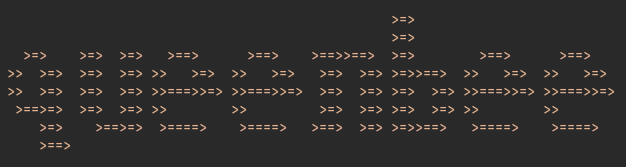
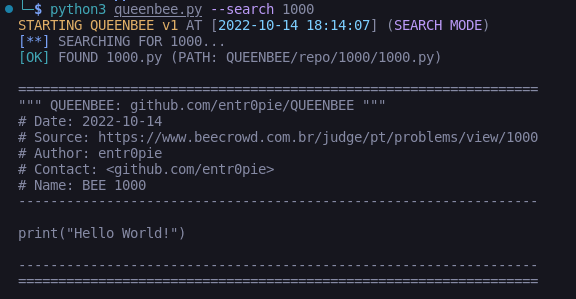
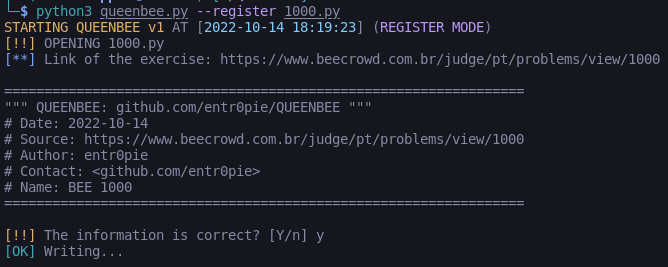
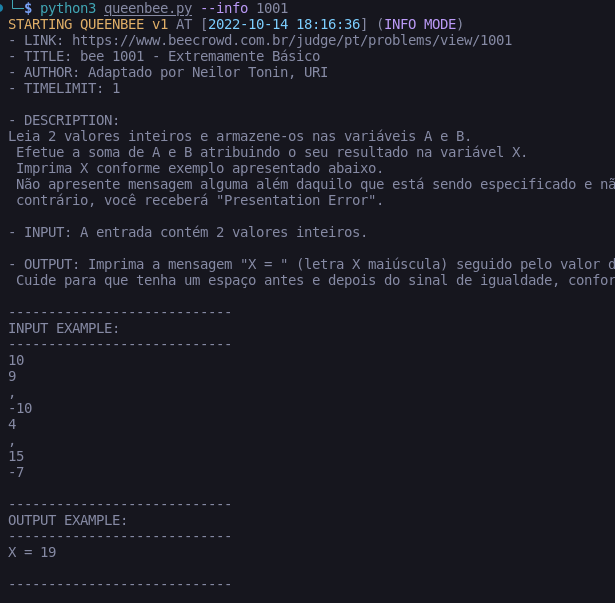

# 🐝 Queenbee 👑

<!---Esses são exemplos. Veja https://shields.io para outras pessoas ou para personalizar este conjunto de escudos. Você pode querer incluir dependências, status do projeto e informações de licença aqui--->
<!---Incrível trabalho do iuricode. Por favor, dá um confere: https://github.com/iuricode/readme-template --->

<!--


-->



> A tool to search, add and store [Beecrowd](https://www.beecrowd.com.br/judge/en) exercise resolutions. 

The project is still under development and the next updates will focus on the following tasks:

- [ ] Create an in-application update (pull, add, commit, push) mechanism;
- [ ] Sync with github repository without downloading all files (aka push without pull);
- [ ] Refactor CREATION MODE;

## 💻 Prerequisites

Before you start, make sure you've met the following requirements:
* Python 3.7 or higher;
* Colorama, BeautifulSoup4, Requests:
```
pip install colorama
pip install beautifulsoup4
pip install requests
```

## 🚀 Instaling QueenBee

Linux e macOS:
```
git clone https://github.com/entr0pie/QUEENBEE
cd QueenBee
python3 installer.py
rm installer.py
```

Windows:
```
git clone https://github.com/entr0pie/QUEENBEE
chdir QueenBee
python3 installer.py
del installer.py
```

## ☕ Using QueenBee

### ❓ Consulting an exercise:


### ❗ Adding a new resolution:


### 🖊️ Getting the exercise prompt:



## 🐝 Contributing with QueenBee
<!---Se o seu README for longo ou se você tiver algum processo ou etapas específicas que deseja que os contribuidores sigam, considere a criação de um arquivo CONTRIBUTING.md separado--->
The best way to help the project is **increasing the database!** Any question that you've done (in any language!) can be added to QUEENBEE repository:
1. Register the exercise:
```
python3 queenbee.py --register my_exercise.rs
```
2. Update the local-repo:
```
git pull 
```

3. Add and push your new exercise!
```
git add .
git commit -m "My new exercise its done!"
git push 
```

<!---
1. Fork this repository.
2. Create an branch: `git checkout -b branch`.
3. Do your modifications and confirm: `git commit -m message`
4. Send it to the original branch: `git push origin QueenBee / branch`
5. Create pull request

As an alternative, search for pull solicitations on [Github Oficial Docs](https://help.github.com/en/github/collaborating-with-issues-and-pull-requests/creating-a-pull-request).
--->
<!--
## 🤝 Colaboradores

Agradecemos às seguintes pessoas que contribuíram para este projeto:

<table>
  <tr>
    <td align="center">
      <a href="#">
        <br>
        <sub>
          <b>Iuri Silva</b>
        </sub>
      </a>
    </td>
    <td align="center">
      <a href="#">
        <br>
        <sub>
          <b>Mark Zuckerberg</b>
        </sub>
      </a>
    </td>
    <td align="center">
      <a href="#">
        <br>
        <sub>
          <b>Steve Jobs</b>
        </sub>
      </a>
    </td>
  </tr>
</table>


## 😄 Seja um dos contribuidores<br>

Quer fazer parte desse projeto? Clique [AQUI](CONTRIBUTING.md) e leia como contribuir.
-->

## 📝 License

This project is under GNU General License. More information [here](LICENSE).


[⬆ Back to the top](#QueenBee)<br>
